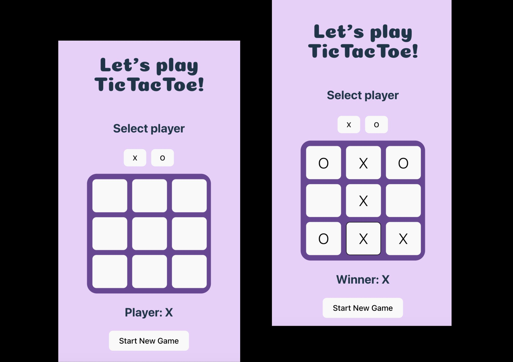

# Tic Tac Toe Game 
A simple and fun interactive tic tac toe game built with React, Typescript and SCSS. 

[**TEST THE GAME HERE!**](https://tic-tac-toe-tau-navy-84.vercel.app/)

 

## Installation 
### 1. Clone this repository 
```
git clone https://github.com/malinjansson/tic-tac-toe.git
```

### 2. Navigate to the project folder
```
cd tic-tac-toe
```

### 3. Install dependencies 
```
npm install 
```
### 4. Run the application 
```
npm run dev
``` 
The application will be available at local: http://localhost:5173/


